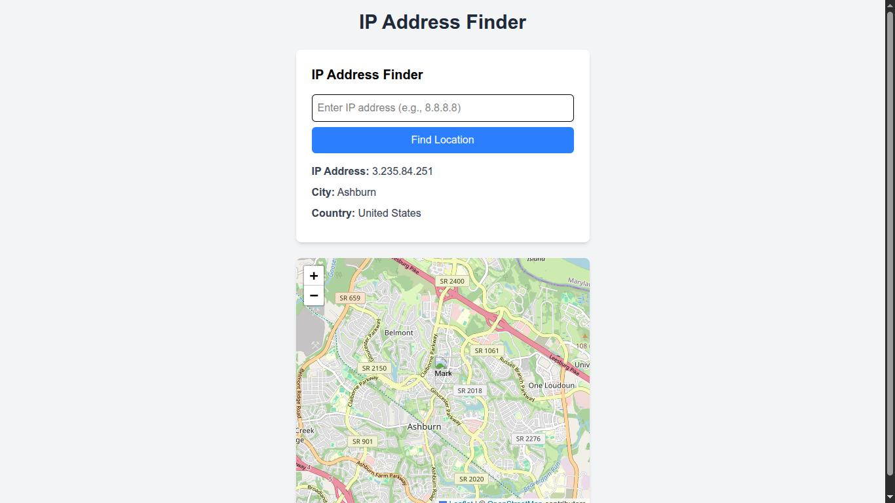

# IP Address Finder

A full-stack React application that fetches and displays a user's IP address and approximate location on an interactive map. Users can input custom IP addresses and compare IP-based locations with their device's precise location using the Geolocation API. A Node.js/Express backend proxies API requests to ensure CORS compatibility.

## Features
- **Automatic IP Detection**: Retrieves the user's public IP address and location details (city, country) via an Express backend.
- **Manual IP Input**: Allows users to enter a custom IP address to fetch its location.
- **Geolocation API Integration**: Displays device location (if permitted) alongside IP-based location.
- **Interactive Map**: Visualizes locations with markers using Leaflet.
- **Responsive Design**: Styled with Tailwind CSS.

## Tech Stack
- **Frontend**: React, Axios, Leaflet, Tailwind CSS, Vite.
- **Backend**: Node.js, Express, Axios.
- **JavaScript**: ES6 (async/await, destructuring).

## Screenshots
- **Main Interface**: 
- **Manual IP Input**: 
- **Loading State**: 

## Installation
### Frontend
```bash
git clone https://github.com/your-username/ip-finder.git
cd ip-finder
npm install
npm run dev